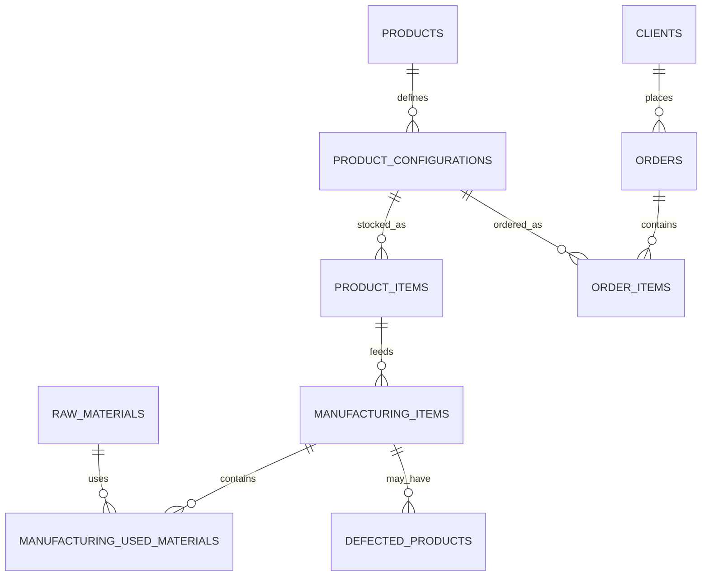

## 1. Бізнес-розуміння

* **Домен**: Операційна база даних для управління виробництвом і продажем готових виробів, сировини, клієнтів та замовлень у B2B-середовищі.
* **Проблема**: Необхідно контролювати запаси сировини, різні конфігурації продуктів, партії на складах, історію замовлень, процеси виробництва та рекламації, щоб підтримувати ключові показники ефективності (KPI): рівень запасів, швидкість виконання замовлень, витрати матеріалів і т. д.
* **Критичні сутності**:

  * **RawMaterials** – сировина для виробництва
  * **Products** – готові вироби
  * **ProductConfigurations** – варіанти продуктів із власними цінами й запасами
  * **ProductItems** – партії за конфігураціями на конкретних складах
  * **Clients** – бізнес-клієнти
  * **Orders** та **OrderItems** – замовлення та їхні позиції
  * **ManufacturingItems**, **ManufacturingUsedMaterials**, **DefectedProducts** – виробничі партії, витрати матеріалів, брак

Ці дані дозволяють формувати звіти про топ-продажі, LTV клієнтів, ефективність використання сировини тощо.

---

## 2. Модель даних і зв’язки



* **1\:N** між Products → ProductConfigurations, Clients → Orders, Orders → OrderItems
* **M\:N** через сполучні таблиці ManufacturingUsedMaterials та OrderItems

---


## 3. Реалізація

### 3.1. Таблиці й обмеження

* Всі **PRIMARY KEY** і **FOREIGN KEY** визначені в DDL (InnoDB автоматично створює індекси) .
* Додані **CHECK-констрейнти** для бізнес-правил:

  ```sql
  ALTER TABLE products
    ADD CONSTRAINT chk_products_price CHECK (price  >= 0),
    ADD CONSTRAINT chk_products_stock CHECK (stock  >= 0);
  ALTER TABLE product_configurations
    ADD CONSTRAINT chk_cfg_price      CHECK (price  >= 0),
    ADD CONSTRAINT chk_cfg_stock      CHECK (stock  >= 0);
  ALTER TABLE raw_materials
    ADD CONSTRAINT chk_rm_stock       CHECK (stock  >= 0);
  ```
* Додані **UNIQUE-ключі** для запобігання дублікатам:

  ```sql
  ALTER TABLE storage_fields ADD UNIQUE KEY uk_storage_code (code);
  ALTER TABLE clients        ADD UNIQUE KEY uk_clients_email (email);
  ALTER TABLE clients        ADD UNIQUE KEY uk_clients_phone (phone);
  ```

### 3.2. Індексація

* PK/FK → автоматичні індекси.
* Додаткові індекси для звітності та приєднань:

  ```sql
  CREATE INDEX idx_orders_client_date   ON orders          (client_id, order_date);
  CREATE INDEX idx_order_items_order    ON order_items     (order_id);
  CREATE INDEX idx_prod_items_config    ON product_items   (configuration_id);
  ```

### 3.3. Користувачі й права

* **reader@%**      – тільки `SELECT`
* **storage\_manager@%** – `SELECT`, `UPDATE`
* **manager@%**     – `SELECT`, `INSERT`, `UPDATE`, `DELETE`
* **analyst@%**     – `SELECT`, `SHOW VIEW`&#x20;

### 3.4. View, процедура, тригери

* **View** `vw_order_summary` – зведення замовлень із іменами клієнтів&#x20;
* **SP** `sp_get_orders_by_client(IN p_client_id)` – всі замовлення клієнта&#x20;
* **Triggers** на `order_items`:

  1. **BEFORE INSERT** – якщо `price_per_unit = 0` → підставити ціну з конфігурації
  2. **AFTER INSERT** – зменшити запаси в конфігурації, у продукті, у партії (FIFO) і оновити `orders.total_price`&#x20;

### 3.5. Заселення даних

* **Seed-скрипти** вставляють:

  * 50 raw\_materials
  * 100 products (+ їх конфігурації)
  * 10 складів
  * 200 000 партій product\_items
  * 20 000 клієнтів
  * 500 000 orders + order\_items (зі виводом прогресу кожні 1000)
  * manufacturing\_items, manufacturing\_used\_materials, defected\_products&#x20;

---

**Під час виправлення багів та налаштувань було створено стільки рядків:**


## 4. Коментарі (документація)

**Додано коментарі до кожної таблиці** та приклад для стовпців:

```sql
-- Коментарі до таблиць
ALTER TABLE raw_materials        COMMENT 'Сировина, що використовується у виробництві';
ALTER TABLE products             COMMENT 'Готова продукція, доступна до продажу';
ALTER TABLE product_configurations COMMENT 'Варіанти продукції з власними цінами та запасом';
-- (зробити те саме для інших таблиць)

-- Приклад коментарів до стовпців у raw_materials
ALTER TABLE raw_materials MODIFY id          INT AUTO_INCREMENT COMMENT 'PK таблиці raw_materials';
ALTER TABLE raw_materials MODIFY name        VARCHAR(100)      COMMENT 'Назва матеріалу';
ALTER TABLE raw_materials MODIFY stock       INT NOT NULL      COMMENT 'Кількість доступного запасу';
```

---

## 5. ERD

Див. розділ 2: Mermaid-діаграма відображає PK/FK-зв’язки й проміжні таблиці .

---

## 6. Пояснення рішення

* **OLTP**: оптимізовано під високочастотні транзакції (500 000+ вставок) і реальне оновлення запасів.
* **Нормалізація** до 3NF: немає дублювання даних (унікальні справи про продукти, замовлення тощо).
* **Індекси** забезпечують швидкі JOIN’и й фільтрацію.
* **SP/тригери** інкапсулюють бізнес-логіку в БД, гарантують консистентність (автопідстановка ціни, автоматичні списання запасів).
* **Розмежування прав** – чітке розділення обов’язків між ролями (читання, оновлення, адміністрування).

---

## 7. KPI та бізнес-використання

* **Оборот запасів**: через ManufacturingUsedMaterials і тригери.
* **Швидкість виконання замовлень**: моніторинг `orders.status` + `order_date`.
* **LTV клієнта**: агрегація через `vw_order_summary`.
* **Рівень браку**: аналіз `defected_products` у порівнянні з виробничими партіями.
